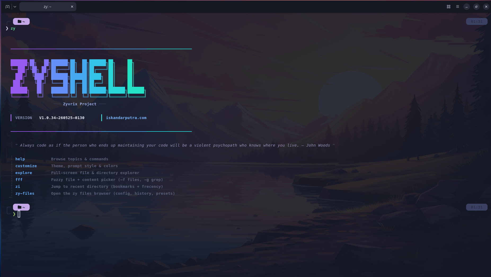
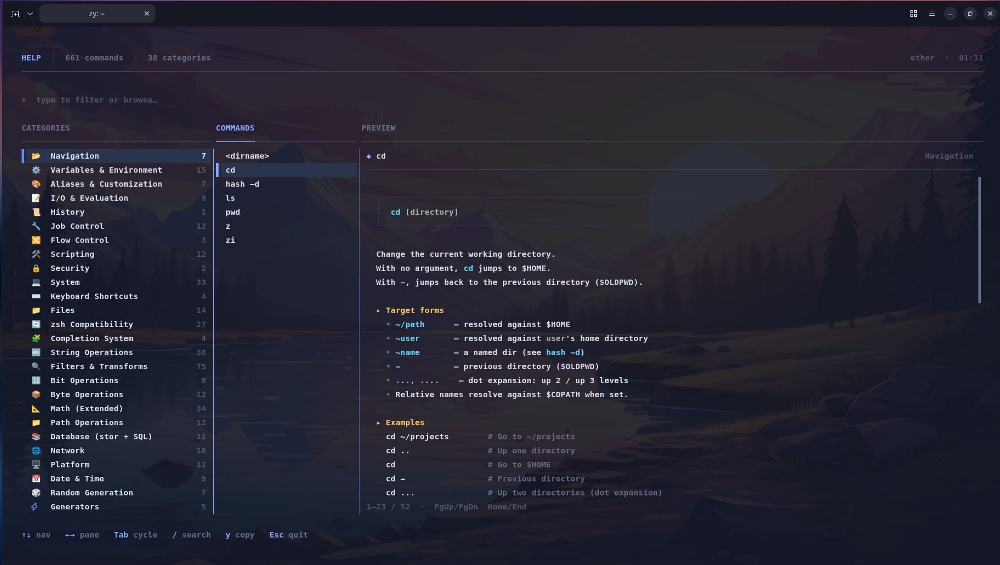
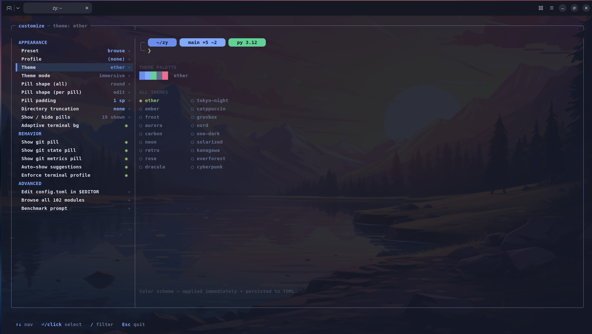
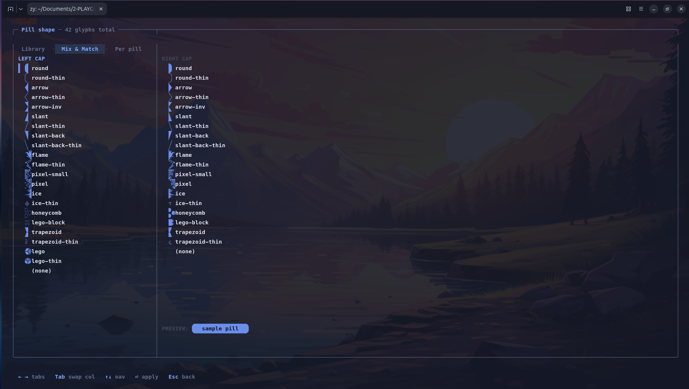
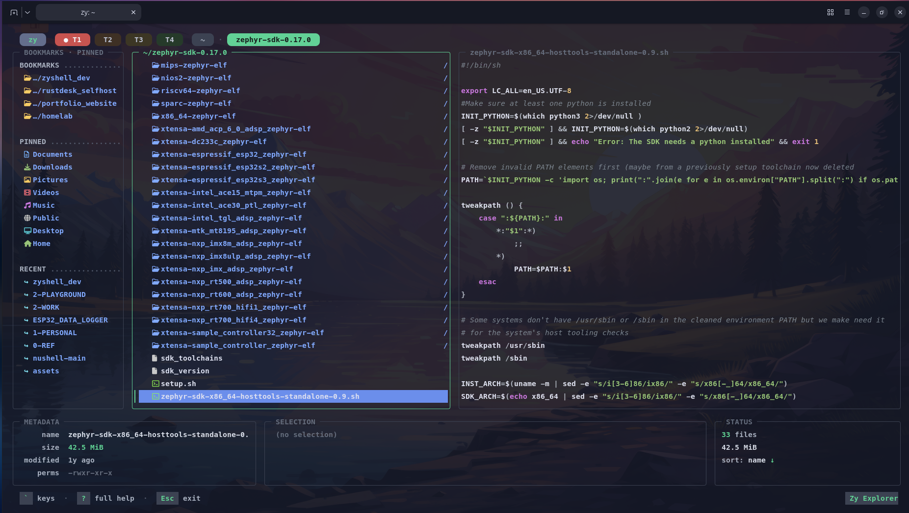
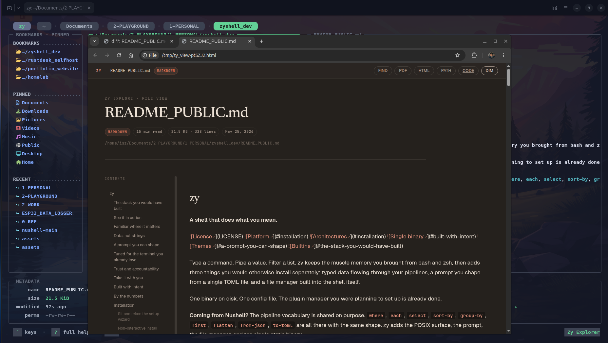
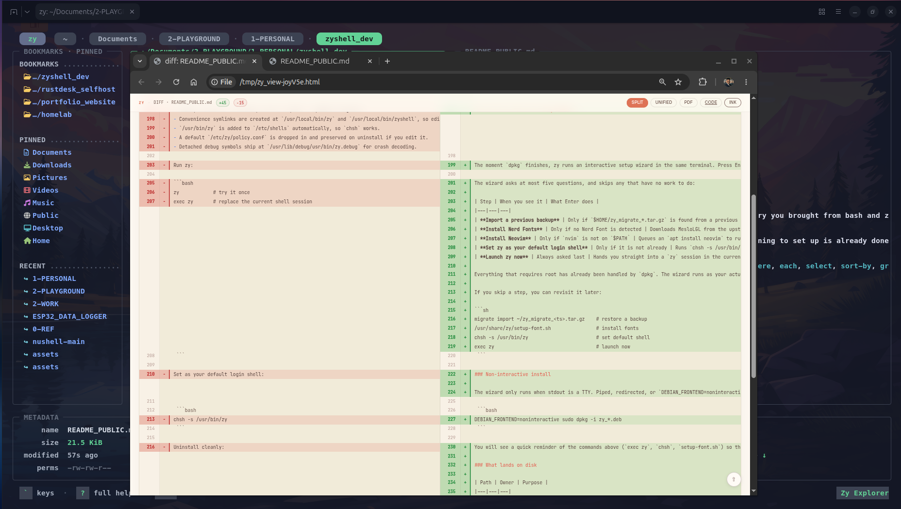
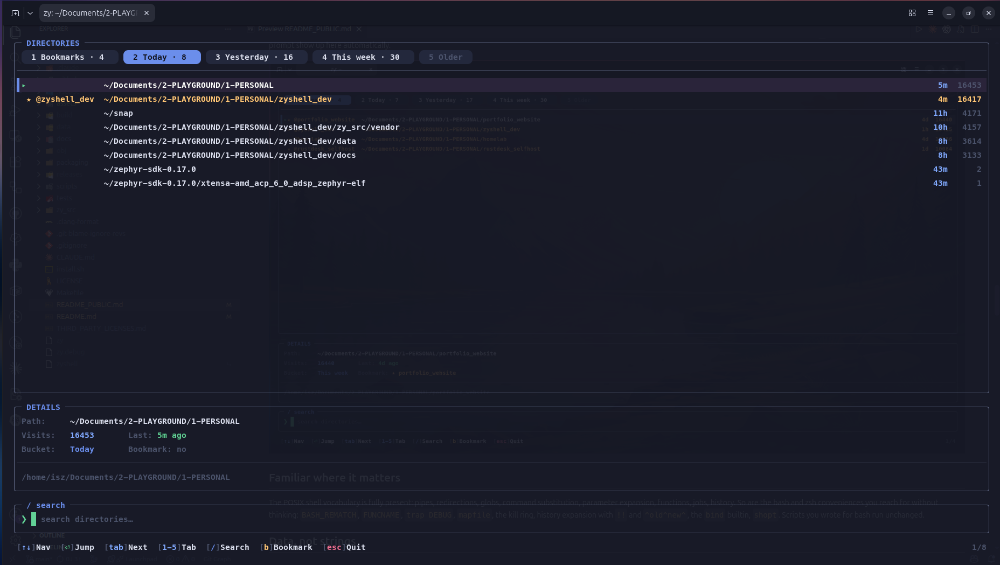
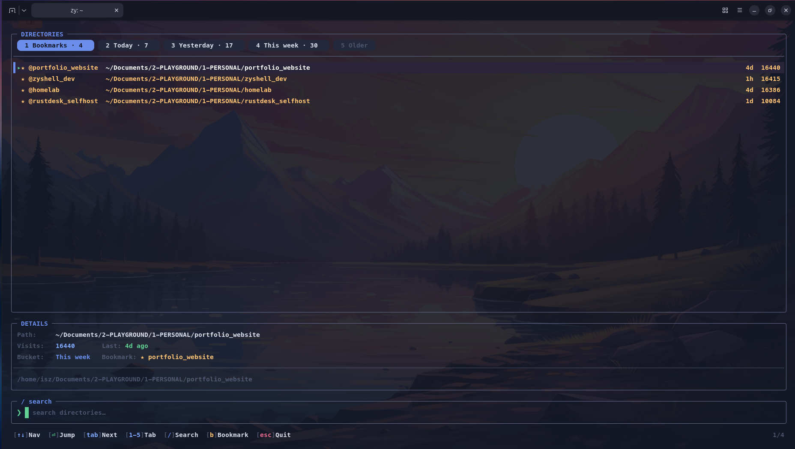

<!--
  README_PUBLIC.md — the PUBLIC release face.
  scripts/release/publish-release.sh extracts THIS file into the public mirror's
  README.md (orphan dist-tmp branch). Keep it end-user-facing: no dev-repo
  internals, no doc-tree paths. The contributor-facing entry point is the
  top-level README.md. Roles are intentionally kept separate (docs reorg
  2026-05-30) — do not merge.
-->
# zy

**Two letters for the shell you reach for.** Full name: `zyshell`. Linux. C. MIT.

Shell. Prompt. Fuzzy picker. Frecency jumper. File manager. Test runner. HTTP client. Migration tool. All built in. One binary, one config file, one `apt remove` if you change your mind.

## Try it in 30 seconds

```sh
docker run --rm -it ghcr.io/iskandarputra/zyshell:latest
```

Drops you into a zy shell inside a fresh container. Type `exit` when you are done. The container is removed automatically.

**Tiny one-time prep**: zy's prompt uses pill glyphs from a Nerd Font. If your terminal's current font is not a Nerd Font you will see boxes where the pill caps should be. Install once with:

```sh
bash <(curl -fsSL https://raw.githubusercontent.com/iskandarputra/zyshell/main/scripts/setup-font.sh)
```

Then point your terminal emulator at "MesloLGL Nerd Font Bold" and re-run the docker line. No font, no charge, fully reversible.

If you like what you see, the [Installation](#installation) section below has the one-liner for a real install.

[](LICENSE)
[](#installation)
[](#installation)
[](#built-with-intent)
[](#a-prompt-you-can-shape)
[](#the-stack-you-would-have-built)

Type a command. Pipe a value. Filter a list. zy keeps the muscle memory you brought from bash and zsh, then adds three things you would otherwise install separately: typed data flowing through your pipelines, a prompt you shape from a single TOML file, and a file manager built into the shell itself.

**Coming from Nushell?** The pipeline vocabulary is shared on purpose. `where`, `each`, `select`, `sort-by`, `group-by`, `first`, `flatten`, `from-json`, `to-toml` are all there with the same shape. zy adds the POSIX surface, the prompt, the file manager, and the single static binary.

```sh
# strings out, data in. Reads like Nushell, runs in zy.
ls | where size > 1mb | sort-by modified | first 5

# inspect any config file as structured data
open Cargo.toml | get dependencies | to-json

# the prompt is configured live, no shell restart
customize
```

## The stack you would have built

A productive terminal usually means a shell plus five to ten tools stitched together with a plugin manager and a dotfiles repo. zy ships the equivalent of all of them in one static binary, already configured to work together from the first prompt.

| Instead of installing | zy gives you |
|---|---|
| **starship** + font setup script | A TOML-driven prompt with 39 themes, 22 pill shapes, 100+ modules, hot-reload, and an interactive `customize` wizard. |
| **fzf** | A built-in `fzf` builtin with the same `'exact / ^prefix / suffix$ / !negate` grammar plus multi-select. |
| **zoxide** or **z.lua** | `z` and `zi` with a frecency store shared across the shell, the file manager, and the help TUI. |
| **yazi**, **ranger**, **lf** | The `explore` command. Miller-columns layout, sixel and kitty image preview, archive browsing in place, mouse and visual mode. |
| **jq**, **yq**, **dasel** | `from-json`, `to-json`, `from-yaml`, `to-toml`, `from-xml`, `from-csv`, plus `get`, `select`, `where`, `sort-by` against any of them. |
| **bat** | Syntax-highlighted file preview in `explore` and the `view` builtin. |
| **ripgrep** | `fff-grep`. Runs in-process with no fork per query, faster than `rg` on warm repeat queries. |
| **nushell** | Structured pipelines with the same vocabulary (`where`, `each`, `select`, `sort-by`, `group-by`, `first`, `flatten`). |
| **chafa** | Native sixel and kitty image preview, no helper binary. |
| **direnv** | A `direnv` prompt module that lights up when a `.envrc` is active in the current directory. |
| **oh-my-zsh** themes and plugins | Completion ergonomics, sensible aliases, and history-aware suggestions baked in. |
| **zsh-autosuggestions**, **zsh-syntax-highlighting** | Inline syntax highlighting and frecency-aware suggestions in the line editor. |
| **gh** for PR status in prompt | A `github_pr` module that surfaces the PR for the current branch as a clickable chip. |
| **sqlite3** CLI for one-offs | `query-db`, `database open`, `database query` builtins. |
| **curl**, **httpie** | `http get`, `http post`, `http head`, `http put`, `http patch`, `http delete` builtins with HTTPS support. |
| A separate **test runner** | `assert-eq`, `assert-true`, `assert-error` builtins and `test-run`. |
| A separate **task runner** | A task-runner builtin that reads `[tasks]` blocks from your config. |
| Plugin managers (**zinit**, **antibody**, **antigen**) | None needed. There is nothing to install on top of the binary. |
| A dotfiles repo to keep all of it in sync across machines | One `~/.zy/config.toml`, plus a one-command `migrate export` (see [Take it with you](#take-it-with-you)). |

This repository is the official release channel. Binaries are published here. Source lives in a private development repo.

## See it in action

### First impression

The moment `zy` opens. A welcome banner, the build-stamped version, and a list of the top-level commands you reach for in your first session.



### Discoverability: `help`

A three-pane browser over every builtin. Categories on the left, commands in the middle, the full documentation on the right. Type to filter, Tab to switch panes, `y` to copy the command name, Esc to leave. The text you see is the same text rendered by `help <cmd>` at the prompt.



### Shape your prompt: `customize`

Pick a theme, a pill shape, which pills to show, how to truncate long directories. The right pane previews every choice live against your active theme. Each change writes through to `~/.zy/config.toml` and the next prompt renders with the new values.



If the 22 named pill shapes are not enough, the Mix & Match tab lets you pick a left cap and a right cap independently from the full Powerline Extra glyph set. The sample pill at the bottom updates as you move through the two columns.



### Live with your files: `explore`

A built-in file manager. Three-pane Miller columns, bookmarks and a frecency sidebar on the left, the focused directory in the middle, a live preview on the right. Syntax-highlighted code, sixel or kitty image rendering, archive browsing in place, mouse and keyboard. The whole surface lives in the project tree; no helper binary on `$PATH`.



Press `H` on a Markdown, source, or text file and the preview pane renders the file as a styled HTML page in the same column. The view is a real HTML render through the bundled exporter, not a half-hearted text recolor.



For files with uncommitted changes, the HTML view becomes a side-by-side diff with the version on disk. Useful when you want to glance at "what did I actually change" without leaving the file manager.



### Jump where you live: `zi`

The directory jumper, grouped by recency: Today, Yesterday, This week, Older, with a separate Bookmarks tab pinned in front. Type to filter, `Tab` (or numbers 1 to 5) to switch tabs, `b` to pin or unpin a bookmark, Enter to jump. The store is shared with `z`, so the directories you visit at the prompt show up here automatically.



The Bookmarks tab shows the entries you have starred for fast keyboard access, independent of frecency.



## Familiar where it matters

The POSIX shell vocabulary is fully present: pipes, redirections, globs, command substitution, parameter expansion, functions, jobs, history. So are the bash and zsh conveniences you reach for without thinking: `BASH_REMATCH`, `FUNCNAME`, `trap DEBUG`, `mapfile`, the kill ring, history expansion with `!!` and `^old^new^`, the `bind` builtin, `shopt`. Scripts you wrote for bash run unchanged.

## Data, not strings

Most shells treat output as a wall of text. zy treats it as data.

Pipelines move records, tables, lists, durations, file sizes, and dates between commands in a typed, in-process form. There is no serialization tax, no awk gymnastics, no fragile column counting. The opener at the top showed the basic shape. Here is what falls out once you keep pulling on that thread:

```sh
# Group every file in the cwd by extension, count each group,
# show the four largest.
ls | group-by extension | each { |g| { ext: $g.0, count: ($g.1 | length) } } | sort-by count --reverse | first 4

# Edit a JSON config in place. No jq, no temp file.
open package.json | upsert version "2.0.0" | save package.json

# Live system query as a structured table. Filter, project, sort,
# all in the same statement.
ps | where mem_mb > 100 | select pid name mem_mb cpu_pct | sort-by mem_mb --reverse

# Pull JSON from any HTTP endpoint and treat it as a table.
http get https://api.github.com/repos/iskandarputra/zyshell/releases | get tag_name | first 5

# Move data across formats without leaving the pipeline.
open inventory.csv | where price > 50 | to yaml | save inventory.yaml
```

Seventeen value types, sixty plus filter and transform commands, conversion in and out of JSON, CSV, TSV, TOML, YAML, XML, HTML, Markdown, and NUON.

## A prompt you can shape

The zy prompt is driven by a single TOML file. Save the file and the next prompt renders with the new configuration, no shell restart and no `source` step. Most users never need to edit the TOML directly: `customize` (shown above) writes through to it for you.

Thirty-nine themes ship in the binary, including light variants and editor classics: GitHub Light and Dark, Atom One Light, Nord Light and Dark, Tokyo Night and Storm, Rose Pine in three moods, Catppuccin, Dracula, Solarized Light and Dark, Gruvbox Light and Dark, Material, Night Owl, Palenight, Monokai, Oxocarbon, Synthwave, Cobalt2, Shades of Purple, and more.

Pills can wear twenty-two cap shapes from the Powerline Extra set, and mix per pill, so your directory segment can look different from your git segment. A hundred plus prompt modules cover languages, cloud and infra context, version control state, and system signals. Slow modules can be marked `async = true` and rendered by background workers, so even a noisy git repository never holds the prompt back.

Switching theme also updates your terminal palette: zy speaks the OSC sequences that GNOME Terminal, Konsole, Kitty, Tilix, Ptyxis, Alacritty, XFCE Terminal, xterm, and Ghostty already listen to. New windows open with the new look.

The model is the one Starship made popular, with a few zy ideas of its own.

## Tuned for the terminal you already love

zy notices which terminal it is running in and adapts accordingly.

On **Ghostty**, the active theme is written into your Ghostty config so new windows open in the same palette as the running shell.

On **Ptyxis**, the active profile's `preserve-directory` is flipped to `always`, so "Open Terminal Here" lands in the folder you actually right-clicked.

On **GNOME Terminal** and **Tilix**, OSC 7 cwd reporting wires up the header-bar path and the "Open in new tab here" workflow.

On any **sixel-capable** or **Kitty-graphics-capable** terminal, image preview is native, with no helper binary on `$PATH`.

The rule is straightforward: when the terminal exposes a capability, zy uses it. When it does not, zy falls back gracefully.

## Trust and accountability

For environments where a shell sits between people and shared infrastructure, zy ships two governance primitives without bolting on external tooling.

A policy engine reads `/etc/zy/policy.conf` and lets administrators express rules about which commands run in which contexts. An audit ledger records every execution with cwd, exit status, and duration, written into a SHA-256 hash chain you can inspect, export, or replay. Day to day they stay out of the way. On the day you need them, the record is already there.

## Take it with you

Configuration is portable in one command.

```sh
migrate export
```

zy writes a timestamped tarball of `~/.zy/`, `~/.zyrc`, your command history, and (if you have edited them) the system policy file and `/etc/zyprofile`. A SHA-256 checksum lands next to it. The whole archive is usually under a megabyte, so it travels well over rsync, cloud sync, or email.

On a new machine, install zy and run:

```sh
migrate import ~/zy_migrate_<timestamp>.tar.gz
```

Your setup is restored verbatim: theme, palette overrides, pinned pill shape, profile overlays, custom modules, bookmarks, frecency database, history. The same flow doubles as a backup: schedule the export and your shell becomes recoverable the way the rest of your dotfiles repo wishes it were.

## Built with intent

zy is a single C binary built with `-Wall -Wextra -Werror` and link-time optimization. The runtime carries no embedded language interpreter, no plugin manager, and no "install these prerequisites first" step. Around 175,000 lines of source, one `.deb` to install, one `apt remove` to undo.

The Debian package ships detached debug symbols, registers the binary under `/etc/shells`, and removes itself cleanly on uninstall. A modified `/etc/zy/policy.conf` is preserved; the default unmodified file is removed. Conservative defaults across the board.

## By the numbers

Counts below are produced directly from the source tree, not from a marketing slide. Every figure can be reproduced from this repo with a one-line shell command.

| | |
|---|---|
| Source | ~175,000 lines of C across 850+ files |
| Builtin commands | 529 (counted by `tests/validation/check_builtin_count.sh`) |
| Runtime value types | 17 (`ZyValType` enum in `zy_src/03_runtime/inc/zy_value.h`) |
| Prompt modules | 100+ across `core/`, `git/`, `cloud/`, `container/`, `system/`, `lang/` |
| Themes | 39 |
| Pill cap shapes | 22 from the Nerd Font Powerline Extra set |
| Format coverage (read) | JSON, CSV, TSV, INI, TOML, YAML, XML, Markdown, NUON, SSV |
| Format coverage (write) | JSON, CSV, TSV, TOML, YAML, XML, HTML, Markdown, NUON, plain text |
| Unit test files | 59 |
| Terminals with explicit integration | 9 (Alacritty, Ghostty, GNOME Terminal, Kitty, Konsole, Ptyxis, Tilix, XFCE Terminal, xterm) |
| Architectures shipped | amd64, arm64, armhf |
| Vendored libraries | 2 (`tomlc99`, `stb_image`) |
| External runtime dependencies you have to install | None |

## Installation

Two lines, same shape as VS Code, 1Password CLI, or Tailscale:

```bash
curl -1sLf 'https://dl.cloudsmith.io/public/iskandarputra/zyshell/setup.deb.sh' | sudo -E bash
sudo apt install zy
```

`sudo apt upgrade` picks up future releases. That is the whole install.

<details>
<summary>Prefer to read the setup script before piping it to <code>bash</code>?</summary>

```bash
# Download, inspect, then run.
curl -1sLf 'https://dl.cloudsmith.io/public/iskandarputra/zyshell/setup.deb.sh' -o setup.sh
less setup.sh
sudo bash setup.sh
sudo apt install zy
```

The script is published and signed by Cloudsmith. It writes one entry under `/etc/apt/sources.list.d/` and imports the repository signing key. Nothing else.
</details>

<details>
<summary>Or: download the <code>.deb</code> directly from GitHub.</summary>

```bash
sudo dpkg -i zy_*.deb
sudo apt-get install -f   # picks up any missing runtime libs
```

Every release also ships a SHA-256 manifest signed with the project's Ed25519 key, fingerprint `D108A9B9CA11369C`. The public key lives at [zy-release.pub](zy-release.pub) in this repo. For the 5-second `minisign + sha256sum -c` verification recipe, see [docs/ops/RELEASE_SIGNING.md](docs/ops/RELEASE_SIGNING.md).
</details>

Full repository policy and removal steps: [docs/ops/APT_REPOSITORY.md](docs/ops/APT_REPOSITORY.md).

### First-run setup

Right after install, zy runs a short wizard in the same terminal. Press Enter on each question to take the recommended default. Re-running the install later picks up any step you skipped.

The wizard asks at most five things, and skips any that have no work to do:

| Step | When you see it | What Enter does |
|---|---|---|
| **Import a previous backup** | Only if `$HOME/zy_migrate_*.tar.gz` is found from a previous machine | Restores `~/.zy/` and `~/.zyrc` from the chosen tarball |
| **Install Nerd Fonts** | Only if no Nerd Font is detected | Downloads MesloLGL from the upstream Nerd Fonts release page and installs it into your user font directory |
| **Install Neovim** | Only if `nvim` is not on `$PATH` | Queues an `apt install neovim` to run right after `dpkg` releases its lock |
| **Set zy as your default login shell** | Only if it is not already | Runs `chsh -s /usr/bin/zy` for the invoking user |
| **Launch zy now** | Always asked last | Hands you straight into a `zy` session in the current terminal |

Everything that requires root has already been handled by `dpkg`. The wizard runs as your actual user (it walks back through `SUDO_USER` and the parent process to find you), so fonts land in your home directory and `chsh` updates your account, not root's.

If you skip a step, you can revisit it later:

```sh
migrate import ~/zy_migrate_<ts>.tar.gz    # restore a backup
/usr/share/zy/setup-font.sh                # install fonts
chsh -s /usr/bin/zy                        # set default shell
exec zy                                    # launch now
```

### Non-interactive install

The wizard only runs when stdout is a TTY. Piped, redirected, or `DEBIAN_FRONTEND=noninteractive` installs print a one-screen summary and exit cleanly, suitable for Dockerfiles and CI:

```bash
DEBIAN_FRONTEND=noninteractive sudo dpkg -i zy_*.deb
```

You will see a quick reminder of the commands above (`exec zy`, `chsh`, `setup-font.sh`) so the machine knows what is available, and nothing blocks.

### What lands on disk

| Path | Owner | Purpose |
|---|---|---|
| `/usr/bin/zy` | dpkg | The shell binary |
| `/usr/bin/zyshell` | dpkg | Long-form symlink to `/usr/bin/zy` |
| `/usr/local/bin/zy` | postinst | Convenience symlink so editors like VS Code find it |
| `/usr/local/bin/zyshell` | postinst | Same, long form |
| `/usr/share/zy/setup-font.sh` | dpkg | The Nerd Font installer the wizard invokes |
| `/usr/share/doc/zy/copyright` | dpkg | MIT license + third-party attribution |
| `/etc/zy/policy.conf` | postinst | System-wide policy file. Preserved on uninstall if you edited it |
| `/etc/shells` entry | postinst | Lets `chsh -s /usr/bin/zy` succeed |

Run `zy-files` at any prompt to see this table live, with a green check for paths that exist, a gray cross for the ones that do not, and the size of each. The same listing covers user data (`~/.zy/`, `~/.zyrc`, history, frecency database, bookmarks) and system files (`/etc/zy/`, `/etc/zyprofile`), so you always know what zy reads, writes, and would remove.

<details>
<summary>Power user: running zy under <code>firejail</code></summary>

```sh
sudo apt install firejail

# No network, private temp $HOME. Useful for exploring the TUIs
# without touching your real config.
firejail --net=none --private=/tmp/zy-eval zy

# Keep real $HOME, block network only.
firejail --net=none zy
```

</details>

### Uninstall

```bash
sudo apt remove zy        # or: sudo dpkg -r zy
```

This removes the binary, the symlinks, the `/etc/shells` entry, and the default unmodified `/etc/zy/policy.conf`. A policy file you actually edited is left in place. Your `~/.zy/` is untouched. To wipe it as well, use `sudo apt purge zy`.

## Documentation

- Website and documentation: https://www.iskandarputra.com
- This repository hosts releases and packaging only. Source code is currently private.

## Acknowledgments

zy stands on the work of others. Each project below shaped a piece of the surface you see today. zy borrows ideas, not code. Every license has been checked and snapshotted in [`THIRD_PARTY_LICENSES.md`](THIRD_PARTY_LICENSES.md), which records the SPDX identifier, the date verified, the upstream URL, and the full text of each license. If an upstream relicenses tomorrow, the evidence of what their license was when zy claimed attribution lives in that file.

### Shell behavior and scripting

| Project | License | What zy borrows |
|---|---|---|
| [Bash](https://www.gnu.org/software/bash/) | GPL-3.0-or-later | The POSIX scripting model, `BASH_REMATCH`, `FUNCNAME`, `trap DEBUG / RETURN / ERR`, `mapfile`, kill ring, `bind`, `shopt`, history expansion. zy is a from-scratch implementation, with no Bash source in the tree. |
| [Zsh](https://www.zsh.org/) | Zsh License (MIT-style) | Compinit semantics, `zstyle`, `zpty`, `compdef`, parameter expansion shorthands, the autosuggestion idea. zy contains no Zsh source. |
| [Oh My Zsh](https://github.com/ohmyzsh/ohmyzsh) | MIT | Completion ergonomics, alias conventions, the "feels good out of the box" bar that zy tries to match. |

### Data pipelines

| Project | License | What zy borrows |
|---|---|---|
| [Nushell](https://github.com/nushell/nushell) | MIT | The structured-data pipeline model. Many builtin names and signatures are shared on purpose so users do not have to learn a new vocabulary. zy contains no Nushell code. |

### Prompt

| Project | License | What zy borrows |
|---|---|---|
| [Starship](https://github.com/starship/starship) | ISC | The TOML-driven, hot-reloading, module-shaped prompt model. The format and style grammar, the `prev_fg` / `prev_bg` gradient idea, the per-module `detect_files` / `detect_folders` / `detect_extensions` convention. zy contains no Starship code. |
| [Powerline Extra Symbols](https://github.com/ryanoasis/powerline-extra-symbols) | MIT | The PUA cap glyph table that powers the 22 pill shapes. zy reads the codepoints; the glyph data lives in the user's Nerd Font. |
| [Nerd Fonts](https://github.com/ryanoasis/nerd-fonts) | MIT (project) and SIL OFL 1.1 (font files) | The packaging that bundles Powerline, Devicons, and Material icons into common monospace fonts. The optional `zy-setup-font` helper downloads MesloLGL from the upstream releases page at install time. zy does not bundle font files in its own package. |

### File manager and pickers

| Project | License | What zy borrows |
|---|---|---|
| [Yazi](https://github.com/sxyazi/yazi) | MIT | The file manager experience that the built-in `explore` aspires to: three pane Miller columns, async preview, sixel + kitty image rendering, archive browsing, visual mode, multi-tab. |
| [fzf](https://github.com/junegunn/fzf) | MIT | The fuzzy picker grammar (`'exact`, `^prefix`, `suffix$`, `!negate`) and the `--multi` / `--reverse` / `--select-1` flag shape. zy's built-in `fzf` builtin is a drop-in for the common subset. |
| [fff](https://github.com/dylanaraps/fff) (the original Bash file manager) | MIT | The name and the spirit. zy's `fff` builtin is a from-scratch C implementation with no shared code. |
| [fff.nvim](https://github.com/dmtrKovalenko/fff.nvim) | MIT | The Rust file picker that inspired the recursive index, the `.gitignore` parser, and the bigram pre-filter. zy's implementation is original C; the design lineage is acknowledged with thanks. |

### Directory navigation

| Project | License | What zy borrows |
|---|---|---|
| [zoxide](https://github.com/ajeetdsouza/zoxide) | MIT | The frecency idea behind `z` and `zi`: time-decayed visit counts that surface the directories you actually use. |
| [z.lua](https://github.com/skywind3000/z.lua) | MIT | Cross-shell frecency conventions, the `zi` interactive picker model. |

### Bundled libraries

| Library | License | What it does |
|---|---|---|
| [tomlc99](https://github.com/cktan/tomlc99) | MIT | TOML parser. Bundled under `zy_src/vendor/tomlc99/`. |
| [stb_image](https://github.com/nothings/stb) | Public domain | PNG / JPEG / GIF / BMP / WebP decoders used by the image preview path. Bundled under `zy_src/vendor/stb/`. |

### Dynamically linked

zy links against, but does not bundle, the following system libraries. These remain owned by their upstream maintainers and are loaded from your system at runtime.

| Library | License | Why |
|---|---|---|
| [SQLite](https://www.sqlite.org) | Public domain | History store, audit ledger, bookmark store. |
| [PCRE2](https://www.pcre.org) | BSD-3-Clause | Regex backend for `=~` and the `match` builtin. |
| [OpenSSL](https://www.openssl.org) | Apache-2.0 (or original SSLeay) | HTTPS support in the built-in HTTP client. |
| [libexpat](https://libexpat.github.io) | MIT | XML parser for `from xml`. |
| [libarchive](https://libarchive.org) | BSD-2-Clause | Optional. Enables in-place archive browsing in `explore`. |

If zy feels comfortable to you, much of the credit belongs upstream.

## License

zy itself is released under the MIT License. See [LICENSE](LICENSE) for the full text.

Copyright (c) 2025-2026 Iskandar Putra.

The bundled vendor libraries retain their original licenses (see the table above). Dynamically linked system libraries are not bundled and remain under the licenses of their respective upstreams.
